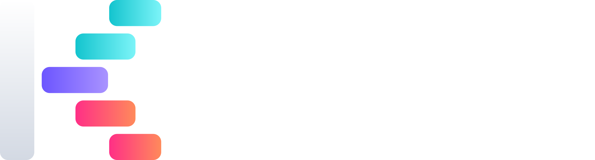
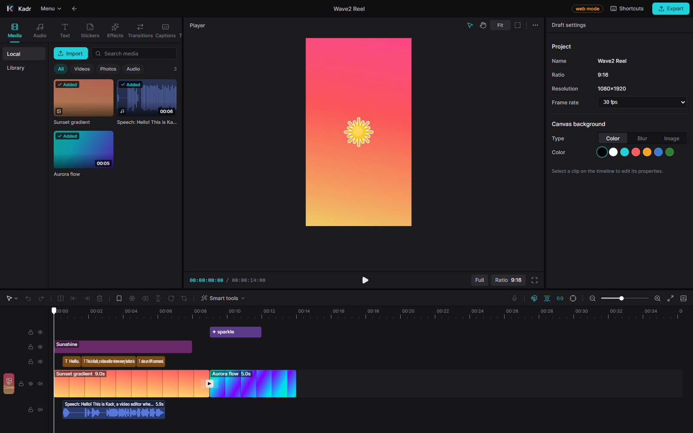
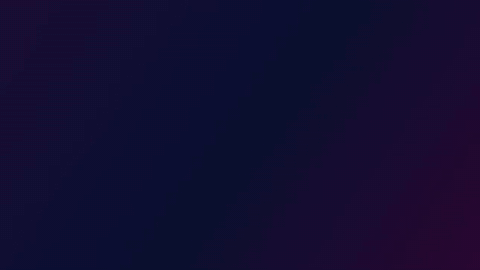
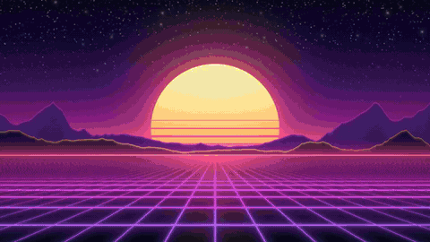
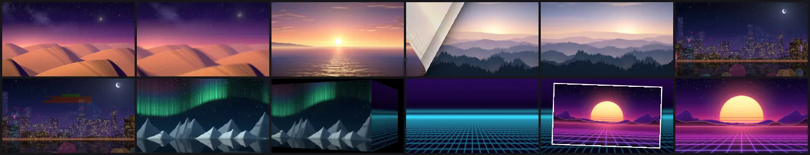

<p align="center">
  
</p>

<h1 align="center">Kadr</h1>

<p align="center">
  <b>The video editor your AI agent can drive.</b><br>
  A CapCut-style desktop editor for Windows where every button, every hotkey and every menu item is also an API call:
  REST, MCP for AI agents, a CLI and live WebSocket events.
</p>

<p align="center">
  <a href="https://github.com/gitkalenyuk/kadr/releases"></a>
  <a href="https://github.com/gitkalenyuk/kadr/releases"></a>
  <a href="#system-requirements"></a>
  <a href="LICENSE"></a>
  <a href="#quick-start-for-ai-agents"></a>
</p>

<p align="center">
  <a href="https://github.com/gitkalenyuk/kadr/releases"><b>Download</b></a> ·
  <a href="https://gitkalenyuk.github.io/kadr/"><b>Website &amp; docs</b></a> ·
  <a href="#quick-start-for-ai-agents">Quick start for AI agents</a> ·
  <a href="https://gitkalenyuk.github.io/kadr/docs/recipes/">AI recipes</a> ·
  <a href="https://gitkalenyuk.github.io/kadr/docs/reference/">Command reference</a> ·
  <a href="CHANGELOG.md">Changelog</a> ·
  <a href="#faq">FAQ</a> ·
  <a href="https://github.com/gitkalenyuk/kadr/issues/new/choose">Report a bug</a>
</p>

<p align="center">
  
</p>

> [!NOTE]
> Kadr is in **public beta**. Releases are published as pre-releases (`0.1.0-beta.1` and up) until 0.1.0 is final.
> Expect rough edges, and please [report them](https://github.com/gitkalenyuk/kadr/issues/new/choose).
> This repository holds **releases, documentation and the website only**. Kadr is closed-source freeware.

---

## Contents

- [What is Kadr?](#what-is-kadr)
- [Why Kadr](#why-kadr)
- [See it in action](#see-it-in-action)
- [Features](#features)
- [Download and install](#download-and-install)
- [Automatic updates](#automatic-updates)
- [Quick start for AI agents](#quick-start-for-ai-agents)
- [System requirements](#system-requirements)
- [Privacy](#privacy)
- [FAQ](#faq)
- [Roadmap](#roadmap)
- [Support](#support)
- [Licence and third-party notices](#licence-and-third-party-notices)

## What is Kadr?

Kadr (from *kadr*, a film frame) is a desktop video editor with the workflow people already know from
CapCut: a media library, a player, an inspector and a magnetic multi-track timeline, plus transitions, effects, filters,
text templates, stickers, auto captions and export presets for TikTok, Reels, Shorts and YouTube.

What makes it different is underneath. Kadr is built around **one command registry**. Every action is a documented
command with typed parameters, units, examples and error hints. The UI buttons, the keyboard shortcuts, the REST API,
the OpenAPI spec, the MCP tools for AI agents, the `kadrctl` CLI and the docs are all generated from that registry, so
they can never drift apart. Whatever you can do with the mouse, a script or an AI agent can do too, and you watch the
edit happen live in the window.

## Why Kadr

<table>
<tr>
<td width="50%" valign="top">

### API-first

160+ commands cover projects, media, timeline, text, captions, colour, audio, AI tools, export, updates and more.
They are exposed through a local **REST API** with an **OpenAPI 3.1** spec, a **WebSocket** event stream and the
**`kadrctl`** CLI. Several edits can run as one atomic, undoable **batch** with an optional **dry run**.

</td>
<td width="50%" valign="top">

### Made for AI agents (MCP)

`kadr-mcp.exe` turns every command into an MCP tool for Claude Desktop, Claude Code or any other MCP client.
Agents get detailed tool descriptions, errors that explain how to fix the call, and **eyes**: `preview_frame`
returns the rendered frame as an image, and `preview_contact_sheet` shows the whole edit in a single picture.

</td>
</tr>
<tr>
<td width="50%" valign="top">

### Offline

No account and no cloud. Rendering, export, Whisper auto captions, text-to-speech, background removal, scene
detection and silence removal all run **on your PC**. Sound effects, stickers and generated backgrounds are
synthesised by Kadr's own engine. Nothing is streamed from a server.

</td>
<td width="50%" valign="top">

### Private

Your media never leaves your machine. The API listens on `127.0.0.1` only and requires a per-user token. Kadr has
no telemetry, no analytics and no ads. Its only network traffic is the update check against this repository (which
you can switch off) and the optional one-time FFmpeg download.

</td>
</tr>
</table>

## See it in action

| Per-letter text animations & word-art | A short edit rendered by the engine |
|---|---|
|  |  |
| **Offline auto captions with word highlight** | **68 original transitions, rendered by the engine** |
|  |  |

## Features

Every row below is available in the UI **and** through the API (the matching commands are in parentheses). The full command reference
with parameters, units and examples is built into the app at `http://127.0.0.1:7777/docs` and published on the
website as the [command reference](https://gitkalenyuk.github.io/kadr/docs/reference/).

### Editing and timeline

| Feature | Details |
|---|---|
| Projects | 10 canvas ratios: 16:9, 9:16, 1:1, 4:3, 3:4, 21:9, 2.35:1, 2:1, 1.85:1 and 5.8-inch. Frame rate, canvas background (colour, blur or image), cover frame, duplicate (`project.create`, `project.set_canvas`, `project.set_cover`) |
| Media | Import video, photo, audio and animated GIF files or whole folders; duplicate detection; thumbnails, filmstrips and waveforms; **proxies** for smooth 4K/HEVC editing; relink moved files (`media.import`, `media.create_proxy`, `media.relink`) |
| Generated media | Gradients, film grain and noise, drifting shapes, countdowns, grids, checkers, stripes and test cards, all rendered locally: 9 kinds, 32 presets (`media.generate`) |
| Multi-track timeline | Main track with **magnet**, video overlays (picture-in-picture), text, sticker, effect, filter, adjustment and audio tracks; snapping; linkage; markers with colour and label; lock, hide and mute tracks |
| Clip tools | Split `Ctrl+B`, delete left/right `Q`/`W`, duplicate, replace, freeze frame, reverse, mirror, rotate, crop with ratio presets, copy/cut/paste |
| Speed | 0.1× to 100× with *keep pitch*, plus speed curves: 6 presets (montage, hero, bullet, jump cut, flash in, flash out) or your own 2 to 20 point curve (`segment.set_speed_curve`) |
| Transform and compositing | Position, scale and rotation with on-canvas handles and snapping guides, opacity, **14 blend modes**, masks (linear, mirror, circle, rectangle, heart, star) with feather, rounding and invert, **chroma key** |
| Keyframes | 22 animatable properties (position, scale, rotation, opacity, volume, 15 colour controls, filter intensity) with linear, ease-in, ease-out and ease-in-out easing (`keyframe.add`) |
| Undo and history | Every edit is one undo step, whether it came from the UI, the API or an agent. Batches are one step too (`edit.undo`, `edit.redo`) |
| My kit | Save text styles, colour settings, filters, effects, transitions and animations as reusable presets for all projects (`presets.save`, `presets.apply`) |

### Colour

| Feature | Details |
|---|---|
| Basic adjustments | 14 sliders: brightness, contrast, saturation, exposure, temperature, tint, highlights, shadows, sharpen, vignette, hue, fade, grain and shine (`segment.set_adjust`) |
| HSL | 8 colour bands (red to magenta) × hue, saturation and lightness, with smooth band blending (`segment.set_hsl`) |
| Curves | Master, R, G and B curves with up to 16 points, plus 7 presets: lighten, darken, fade, contrast, cool, warm, vintage (`segment.set_curves`) |
| LUTs | Load any `.cube` LUT, with an intensity control |
| Auto adjust | One click analyses the frame and fixes exposure, contrast, white balance and saturation (`adjustment.auto_enhance`) |
| Filters | 70 original filters in 18 categories, each with a keyframable intensity (`filter.apply`, `filter.add`) |
| Adjustment layers | Grade everything below a time range at once (`adjustment.add`) |
| Clean-up | Video denoise and deflicker (`segment.set_video_cleanup`) |

### Text and captions

| Feature | Details |
|---|---|
| Text styling | 4 built-in fonts plus every font installed on your PC, with fallback for Cyrillic and CJK. Stroke and extra outlines, shadow, background box, glow, linear or radial gradient fill, 3D extrude, curved text, letter case (`text.add`, `text.update`) |
| Templates and word art | 46 text templates in 9 categories and 22 word-art effects (gradient, metal, glow, 3D, outline, retro) (`text.apply_template`, `text.apply_effect`) |
| Per-letter animation | 39 text animations: 17 in, 11 out and 11 loop. Typewriter, letter rise, karaoke sweep, scramble, word pop, wave and more. They combine with clip animations (`text.set_glyph_animation`) |
| **Auto captions** | Offline speech recognition with Whisper (faster-whisper): about 100 languages plus auto-detect, word-level timestamps, model choice from `tiny` to `large-v3`, NVIDIA GPU acceleration (`captions.auto`) |
| Caption styles | 15 styles, including **word highlight** and karaoke looks that follow the spoken words (`captions.set_style`) |
| Caption editor | Edit, split, merge, shift and restyle cues (`captions.update`, `captions.split`, `captions.merge`, `captions.shift`) |
| Subtitle files | Import SRT, VTT, ASS/SSA and LRC. Export SRT, VTT, TXT and LRC (`captions.import`, `captions.export`) |
| **Transcript editing** | Delete words from the transcript and the video is cut to match. One-click *remove filler words* (English, Ukrainian and Russian lists, plus your own) and *remove pauses* (`transcript.delete_words`, `transcript.remove_fillers`, `transcript.remove_pauses`) |
| Text to speech | Local voices (Windows SAPI voices and eSpeak NG in about 130 languages), loudness-normalised, with an option to fit the text clip to the speech (`tts.speak`, `tts.from_text`) |

### Library

Everything in the library is **original**: it is generated or rendered by Kadr's own engine. No CapCut assets are used.

| Library | Items | Categories |
|---|---:|---:|
| Transitions, including 3D cube and flip, iris shapes, blinds, ripple, swirl and zoom blur, with direction and softness options | **68** | 11 |
| Video effects, each with its own parameter sliders | **56** | 14 |
| Filters | **70** | 18 |
| Clip animations: 44 in, 44 out, 28 combo and 20 loop | **136** | 4 |
| Text templates | **46** | 9 |
| Text effects (word art) | **22** | 7 |
| Text animations, per letter and per word | **39** | 3 |
| Caption styles | **15** | 5 |
| Stickers: callouts, doodles, frames, countdowns, social, sale tags, weather and more | **82** | 14 |
| Sound effects, synthesised offline | **47** | 9 |
| Voice effects | **25** | 5 |
| Generated media presets | **32** | 7 |

### Audio

| Feature | Details |
|---|---|
| Mixing | Volume in dB with keyframes, fade in/out, track mute (`segment.set_volume`, `segment.set_fade`) |
| Voice changer | 25 voice effects, from chipmunk, robot and megaphone to cathedral, lo-fi and vocal enhance (`segment.set_audio`) |
| Clean-up | Noise reduction and loudness normalisation to −14 LUFS with a true-peak limit (`segment.set_audio`) |
| Analysis | EBU R128 loudness meter (LUFS, LRA, true peak) and beat detection with BPM that can drop markers on every beat (`audio.loudness`, `audio.detect_beats`) |
| Separate audio | `Ctrl+Shift+S` moves a clip's sound to its own linked audio clip. Restore it any time (`audio.separate`, `audio.restore`) |
| Sound effects | 47 built-in SFX (whooshes, pops, impacts, UI clicks, risers, countdowns, ambience) with hover preview (`sfx.add`) |

### AI and smart tools (all local)

| Tool | What it does |
|---|---|
| Auto captions | Whisper speech-to-text with word timings, then styled caption cues (`captions.auto`) |
| Remove background | Cuts out the person or main subject without a green screen, using `rembg`, `onnxruntime` or `torch` on your machine (`ai.remove_background`) |
| Split scenes | Detects shot changes and splits the clip at every cut (`ai.detect_scenes`, `ai.split_scenes`) |
| Remove silence | Cuts silent stretches out of talking-head videos and podcasts and closes the gaps (`ai.remove_silence`) |
| Auto reframe | Turns 16:9 footage into 9:16 (or any ratio) by following the subject with smoothed keyframes (`ai.auto_reframe`) |
| Auto adjust | Automatic exposure, contrast and white balance (`adjustment.auto_enhance`) |
| Capability check | `ai.capabilities` and `captions.asr_status` report what is installed and how to enable what is missing |

### Export

| Feature | Details |
|---|---|
| Video | 480p, 720p, 1080p, 2K and 4K; 24, 25, 30, 50 and 60 fps; **H.264** or **HEVC** in MP4 or MOV; quality presets (lower, recommended, higher) or a custom bitrate |
| GPU encoding | NVIDIA NVENC, Intel Quick Sync and AMD AMF are used automatically when available, with a software fallback (libx264/libx265) |
| More formats | Animated **GIF**, audio-only **MP3, WAV, AAC, FLAC**, export of a time range |
| Workflow | Size estimate before export, background queue with progress, cancel and *open folder* (`export.estimate`, `export.start`, `export.status`) |

### Automation

| Interface | Details |
|---|---|
| REST API | `http://127.0.0.1:7777/api/v1/commands/<name>`. Bearer-token auth, JSON in and out, errors with a code, a message and a **hint** |
| OpenAPI | `GET /api/v1/openapi.json` (OpenAPI 3.1). The full HTML command reference at `http://127.0.0.1:7777/docs` |
| Batches | `POST /api/v1/projects/{id}/batch` runs many commands as **one atomic undo step**. `dry_run: true` validates without saving |
| Events | WebSocket `ws://127.0.0.1:7777/api/v1/events`: project changes, playhead, import, export, captions and AI progress |
| MCP | `kadr-mcp.exe` (stdio) exposes every command as a tool, plus `kadr_batch`. Images come back as real image content |
| CLI | `kadrctl commands`, `kadrctl describe <command>`, `kadrctl run <command> --param value`, `kadrctl batch`. Human time formats such as `2.5s` and `00:01:02.5` |
| Headless | `kadr-server.exe` runs the same engine and API without a window, for pipelines and batch jobs |

## Download and install

### Installer (recommended)

1. Open the [**Releases**](https://github.com/gitkalenyuk/kadr/releases) page and download
   **`Kadr-Setup-<version>-x64.exe`**, for example `Kadr-Setup-0.1.0-beta.1-x64.exe`.
2. Run it. The default is a per-user install into `%LOCALAPPDATA%\Programs\Kadr`, which **needs no administrator
   rights**. You can also choose an all-users install. Optional tasks: a desktop shortcut, and **Add kadrctl and
   kadr-mcp to PATH** (handy for terminals and AI agents).
3. **Windows SmartScreen.** Kadr builds are not code-signed yet, so Windows may show *"Windows protected your PC"*.
   Click **More info → Run anyway**. You can confirm the file is the one we published by checking its hash
   ([below](#verify-your-download)).
4. The installer checks for the **Microsoft Edge WebView2 Runtime**, which is preinstalled on Windows 11 and most
   Windows 10 PCs, and points you to Microsoft's installer if it is missing.
5. **First launch: FFmpeg.** Kadr uses FFmpeg for all decoding and encoding but does not ship it. On first launch
   choose **Download now** and Kadr fetches the official GPL build of FFmpeg 7.1 from the
   [BtbN FFmpeg builds](https://github.com/BtbN/FFmpeg-Builds) (about 100 MB), checks its SHA-256, and extracts only
   `ffmpeg.exe` and `ffprobe.exe` into `%LOCALAPPDATA%\Kadr\tools\ffmpeg\bin`. If you already have FFmpeg, choose
   **I have FFmpeg** and pick its folder. An `ffmpeg` on your `PATH` is detected automatically.

What gets installed:

| File | Purpose |
|---|---|
| `Kadr.exe` | The editor |
| `kadr-server.exe` | Headless engine and API, no window |
| `kadr-mcp.exe` | MCP server for AI agents (stdio) |
| `kadrctl.exe` | Command-line client |
| `licenses\` | EULA and third-party notices |

Where your data lives:

| Path | Contents |
|---|---|
| `%APPDATA%\Kadr\` | Projects, settings, presets (*My kit*), the API token (`api-token`), library caches |
| `%LOCALAPPDATA%\Kadr\tools\ffmpeg\bin\` | `ffmpeg.exe` and `ffprobe.exe`, if Kadr downloaded them for you |
| `%USERPROFILE%\Videos\Kadr\` | Default export folder |

### Portable zip

Download **`Kadr-<version>-windows-x64-portable.zip`**, extract it anywhere (for example to a USB drive) and run
`Kadr.exe`. The portable build has the same features. It still keeps projects in `%APPDATA%\Kadr` and needs WebView2.
It tells you when a new version is out but does not install updates itself: extract the new zip over the old folder.

### Verify your download

Each release includes `SHA256SUMS.txt`. In PowerShell:

```powershell
Get-FileHash .\Kadr-Setup-0.1.0-beta.1-x64.exe -Algorithm SHA256
# compare the Hash value with the matching line in SHA256SUMS.txt
```

### Uninstall

Use **Settings → Apps → Installed apps → Kadr → Uninstall**. The uninstaller asks whether to also delete your projects
and settings (`%APPDATA%\Kadr`) and the tools Kadr downloaded, such as FFmpeg. Answer **No** to keep them for a later
installation.

## Automatic updates

Kadr can update itself from the releases in this repository:

- **When it checks.** In the background at most once a day, without slowing down startup, and whenever you click
  **Settings → Updates → Check now** (or **Check for updates…** in the menu). You can turn automatic checks off, or
  skip a version, there.
- **What it downloads.** Every release has a small manifest, `latest.json`, with the version, release notes, and the
  SHA-256 hash and size of the installer.
- **How it is verified.** The manifest is signed with an **Ed25519** key (`latest.json.sig`), and the matching
  public key is built into Kadr. Kadr installs an update only if **the signature is valid and the installer's
  SHA-256 matches the manifest**. If either check fails, nothing is installed. Development builds without a key only
  offer a link to the download page.
- **How it installs.** The new installer runs silently, closes Kadr, upgrades in place, keeps your projects and
  settings, and starts Kadr again.
- **Channels.** **Stable** gets final releases. **Beta** also gets pre-releases. Choose the channel in
  **Settings → Updates**. A pre-release build such as `0.1.0-beta.1` uses the Beta channel by default, so during the
  public beta you get every new beta automatically. A pre-release is never offered on the Stable channel.
- **Portable and development builds** only tell you about new versions and link to the release page.
- **For agents.** Updates are commands too: `update.check`, `update.status`, `update.download`, `update.install`,
  `update.skip` and `update.settings`. FFmpeg setup works the same way with `tools.status`, `tools.install_ffmpeg`
  and `tools.set_ffmpeg_dir`.

See [SECURITY.md](SECURITY.md) for the details and for how to verify a release by hand.

## Quick start for AI agents

### 1. Start Kadr

Open the Kadr app, or run `kadr-server.exe` for a headless engine. The API listens on `http://127.0.0.1:7777`.
On first run Kadr creates a random API token in **`%APPDATA%\Kadr\api-token`**. `kadr-mcp` and `kadrctl` read it
automatically, so you never paste it into a config file.

### 2a. Claude Desktop

Open **Settings → Developer → Edit Config**, which opens `%APPDATA%\Claude\claude_desktop_config.json`, and add:

```json
{
  "mcpServers": {
    "kadr": {
      "command": "C:\\Users\\<you>\\AppData\\Local\\Programs\\Kadr\\kadr-mcp.exe"
    }
  }
}
```

Restart Claude Desktop. The Kadr tools appear in the tools menu.

### 2b. Claude Code

```powershell
claude mcp add --scope user kadr -- "$env:LOCALAPPDATA\Programs\Kadr\kadr-mcp.exe"
```

Run `/mcp` inside Claude Code to check that `kadr` is connected.

### 2c. Any other MCP client

Use a **stdio** server with the command `kadr-mcp.exe` and no arguments. Tool names use underscores
(`timeline_segment_split` for `timeline.segment.split`). The extra `kadr_batch` tool applies many edits as one undo
step. The Kadr app (or `kadr-server.exe`) must be running.

### 3. Ask for an edit

> *Create a 9:16 project from the clips in `C:\Users\me\Videos\Trip`, remove the silences, add auto captions in the
> word-highlight style, put a whoosh on every cut, show me a contact sheet, then export 1080p.*

A typical agent session looks like this, and you can watch every step land on the timeline:

```text
project_create {name, ratio: "9:16"}  →  media_import {paths}  →  timeline_segment_add …
ai_remove_silence  →  captions_auto {style_id: "cap_highlight_word", wait: true}
sfx_add …  →  preview_contact_sheet  (the agent looks at the result)  →  export_start {resolution: "1080p"}
```

More end-to-end [AI recipes](https://gitkalenyuk.github.io/kadr/docs/recipes/) are on the website, along with the
full guides for [MCP setup](https://gitkalenyuk.github.io/kadr/docs/mcp.html), the
[REST API](https://gitkalenyuk.github.io/kadr/docs/rest.html) and [kadrctl](https://gitkalenyuk.github.io/kadr/docs/cli.html).

### REST in 60 seconds

PowerShell:

```powershell
$token = (Get-Content "$env:APPDATA\Kadr\api-token" -Raw).Trim()
$h     = @{ Authorization = "Bearer $token" }
$api   = "http://127.0.0.1:7777/api/v1"

$p = (Invoke-RestMethod -Method Post "$api/commands/project.create" -Headers $h `
        -ContentType 'application/json' -Body '{"name":"My TikTok","ratio":"9:16"}').result
$p.id
```

Bash (Git Bash or WSL with the token copied over):

```bash
TOKEN=$(cat "$APPDATA/Kadr/api-token")
curl -s -X POST http://127.0.0.1:7777/api/v1/commands/project.create \
  -H "Authorization: Bearer $TOKEN" -d '{"name":"My TikTok","ratio":"9:16"}'
# → {"ok":true,"result":{"id":"prj_…", …}}

# Several edits as ONE undo step (add "dry_run": true to only validate):
curl -s -X POST http://127.0.0.1:7777/api/v1/projects/prj_…/batch -H "Authorization: Bearer $TOKEN" -d '{
  "calls": [
    {"command": "text.add",   "args": {"text": "Day 1", "template_id": "title_bold", "at_us": 0, "duration_us": 3000000}},
    {"command": "filter.add", "args": {"filter_id": "film", "at_us": 0, "duration_us": 5000000, "intensity": 0.6}}
  ]}'
```

Times are **integers in microseconds** (`1 s = 1000000`). Every error carries a `hint` that tells you, or your
agent, how to fix the call.

### kadrctl

```powershell
kadrctl commands timeline                 # list the commands of a category
kadrctl describe captions.auto            # full documentation of one command
kadrctl run project.create --name "My TikTok" --ratio 9:16
kadrctl run timeline.segment.split --project_id prj_123 --segment_id seg_4 --at_us 2.5s
kadrctl batch prj_123 edits.json --dry-run
```

If you didn't tick *Add kadrctl and kadr-mcp to PATH* in the installer, call it as
`& "$env:LOCALAPPDATA\Programs\Kadr\kadrctl.exe"`. Set `KADR_ADDR` and `KADR_TOKEN` to target another instance.

## System requirements

| | Minimum | Recommended |
|---|---|---|
| OS | Windows 10 version 1809 (64-bit) | Windows 11 (64-bit) |
| CPU | 64-bit (x64) processor | 6 or more cores |
| Memory | 4 GB | **8 GB** or more (16 GB for 4K) |
| Graphics | Any GPU supported by Windows | NVIDIA, Intel or AMD GPU with a hardware video encoder |
| Runtime | Microsoft Edge WebView2 Runtime (preinstalled on Windows 11) | |
| FFmpeg | Downloaded by Kadr on first launch, or your own FFmpeg | |
| Disk | About 1 GB for Kadr and FFmpeg, plus room for projects, caches and proxies | SSD |

Optional extras unlock more features. Kadr detects them at run time and tells you how to enable anything that is
missing.

| Optional | Enables |
|---|---|
| **NVIDIA GPU** (NVENC; CUDA for Whisper) | Fast H.264/HEVC export and GPU-accelerated auto captions. Intel Quick Sync and AMD AMF are used for export too |
| **Python 3.9+ and `faster-whisper`** (`pip install faster-whisper`, then download a model once) | Auto captions and transcript editing |
| **`rembg` / `onnxruntime`** (`pip install rembg onnxruntime`) or an ONNX matting model | AI background removal |
| **eSpeak NG** | Text-to-speech in about 130 languages, in addition to the Windows voices |

Run `captions.asr_status` and `ai.capabilities` (or open the matching panels in the app) to see what Kadr found.
`KADR_PYTHON` selects a specific Python interpreter.

## Privacy

- **Your media stays on your PC.** Kadr does not upload, sync or analyse your files anywhere else. Speech recognition,
  background removal and every other AI tool run locally.
- **No account, no telemetry, no analytics, no ads.**
- **Network access** is limited to the update check (an HTTPS request to GitHub for `latest.json`, at most once a day,
  and you can switch it off), downloading an update you accepted, and the optional one-time FFmpeg download (about 100 MB) from
  GitHub. Python packages and Whisper or matting models that *you* install may download their own model files
  when you set them up.
- **The local API is private to your machine.** It binds to `127.0.0.1`, accepts only loopback origins and requires
  the token stored in `%APPDATA%\Kadr\api-token`. To revoke access for every tool, delete that file and restart
  Kadr to get a new token.
- **AI agents act with your permissions.** An MCP client connected to Kadr can edit and delete your Kadr projects
  and write exported files. Connect only agents you trust. Every edit can be undone.

## FAQ

<details>
<summary><b>Is Kadr free?</b></summary>

Yes. Kadr is **freeware**: free to use on any number of your computers, including for commercial work, with no
watermark, no subscription and no account. The videos you make are yours. Kadr is closed source, so this repository
contains releases and documentation but no code. The full terms are in [LICENSE](LICENSE).
</details>

<details>
<summary><b>Is Kadr CapCut? Is it affiliated with CapCut or ByteDance?</b></summary>

No. Kadr is an independent editor that follows a familiar CapCut-style workflow. All of its transitions, effects,
filters, templates, stickers, sounds and caption styles are original, and none are copied from CapCut. *CapCut* is a
trademark of its owner.
</details>

<details>
<summary><b>Windows says "Windows protected your PC". Is it safe?</b></summary>

The installer is not yet signed with a paid code-signing certificate, so SmartScreen does not recognise it. Click
**More info → Run anyway**. To be sure you have the genuine file, compare its SHA-256 with `SHA256SUMS.txt` from
the same release. Updates installed by Kadr itself are always verified (Ed25519 signature plus SHA-256).
</details>

<details>
<summary><b>Why does Kadr need FFmpeg, and why isn't it included?</b></summary>

FFmpeg decodes and encodes every video and audio file. Kadr runs it as a separate program and does not bundle it.
On first launch Kadr can download the official BtbN GPL build (FFmpeg 7.1, about 100 MB, SHA-256 verified) for you.
Or use an FFmpeg you already have: choose its folder, put it on your `PATH`, or set `KADR_FFMPEG_DIR`. See
[THIRD_PARTY_NOTICES.md](THIRD_PARTY_NOTICES.md).
</details>

<details>
<summary><b>Which AI agents can use Kadr?</b></summary>

Any MCP client (Claude Desktop, Claude Code and other MCP-capable tools) through `kadr-mcp.exe`, and anything that can
make HTTP requests through the REST API. Scripts can use `kadrctl`.
</details>

<details>
<summary><b>Can the agent see what it made?</b></summary>

Yes. `preview_frame` returns the rendered frame as an image, the exact picture the export will contain.
`preview_contact_sheet` puts many moments of the timeline into one image, so the agent can review pacing, captions and
overlays at a glance.
</details>

<details>
<summary><b>What if the agent makes a mess?</b></summary>

Press `Ctrl+Z`. Every edit an agent makes is a normal undo step, and a `kadr_batch` is a single step. Agents can
also do a **dry run** of a batch to check it before anything changes.
</details>

<details>
<summary><b>Auto captions say "not available".</b></summary>

Install Python 3.9+ and run `pip install faster-whisper`, then download a model once, for example
`python -c "from faster_whisper import WhisperModel; WhisperModel('small')"`. If Python is not on your `PATH`, set
`KADR_PYTHON`. `captions.asr_status` shows what Kadr detects. An NVIDIA GPU makes recognition several times faster.
</details>

<details>
<summary><b>Background removal says "not available".</b></summary>

Run `pip install rembg onnxruntime`. rembg downloads its model on first use. Alternatively, put an ONNX matting model at
`%APPDATA%\Kadr\models\matting.onnx`. Check the result with `ai.capabilities`.
</details>

<details>
<summary><b>Can I run Kadr without a window, on a server or in a pipeline?</b></summary>

Yes. `kadr-server.exe` runs the same engine and API headless. Use `KADR_DATA_DIR` and `KADR_ADDR` to run isolated
instances side by side.
</details>

<details>
<summary><b>Port 7777 is already in use.</b></summary>

Set the environment variable `KADR_ADDR`, for example `127.0.0.1:7788`, for Kadr and for the tools that talk to it
(`kadr-mcp`, `kadrctl`).
</details>

<details>
<summary><b>Which files can I import?</b></summary>

Video: MP4, MOV, M4V, MKV, WebM, AVI, WMV, FLV, MTS/M2TS, TS, 3GP, MPEG, OGV, MXF and animated GIF.
Audio: MP3, WAV, AAC, M4A, FLAC, OGG, Opus, WMA and AIFF. Images: JPEG, PNG, BMP, WebP, TIFF, HEIC/HEIF and AVIF.
Files are decoded by FFmpeg, so the codecs inside them must be supported by your FFmpeg build. The official GPL build
Kadr downloads covers all common ones.
</details>

<details>
<summary><b>macOS or Linux?</b></summary>

Not yet. The engine is cross-platform and native builds are on the [roadmap](#roadmap).
</details>

## Roadmap

These are plans, not promises. Vote for what you need with a thumbs-up reaction on
[feature requests](https://github.com/gitkalenyuk/kadr/issues?q=is%3Aissue+label%3Aenhancement).

- **macOS and Linux builds**
- **Code-signed installer**, so SmartScreen stops warning
- **winget** and **Scoop** packages
- **Project templates** with replaceable media slots
- **Original music library** of royalty-free loops and beds
- Animated stickers and more generated media
- Body effects based on person segmentation (outline, aura, clone)
- Motion tracking (text and stickers that follow an object) and camera tracking
- Optical-flow slow motion and frame interpolation
- Retouch tools
- More languages for filler-word removal
- A plugin API for third-party asset providers

## Support

- **Questions and how-tos:** see the [website and docs](https://gitkalenyuk.github.io/kadr/) and the [FAQ](#faq).
- **Bugs:** [open a bug report](https://github.com/gitkalenyuk/kadr/issues/new?template=bug_report.yml). Include your
  Kadr version (**Settings → About**).
- **Ideas:** [request a feature](https://github.com/gitkalenyuk/kadr/issues/new?template=feature_request.yml).
- **Security issues:** please report them privately. See [SECURITY.md](SECURITY.md).

More in [SUPPORT.md](SUPPORT.md).

## Licence and third-party notices

Kadr is **freeware, closed source**. It is free to use under the terms of the [End User Licence Agreement](LICENSE),
which also defines what you may and may not do with the binaries.

Kadr is built with open-source components (Go, Wails, React and others) whose licences are listed in
[THIRD_PARTY_NOTICES.md](THIRD_PARTY_NOTICES.md) and in the `licenses\` folder of every installation. **FFmpeg** is
not distributed with Kadr. It is downloaded on request from the official BtbN builds under the GNU GPL, and Kadr
runs it as a separate program.

---

<p align="center">
  <a href="https://gitkalenyuk.github.io/kadr/">gitkalenyuk.github.io/kadr</a> ·
  <i>CapCut is a trademark of its respective owner. Kadr is not affiliated with or endorsed by CapCut or ByteDance.</i>
</p>
