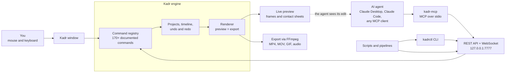

<p align="center"><b>English</b> · <a href="README.uk.md">Українська</a></p>

<p align="center">
  <picture>
    <source media="(prefers-color-scheme: dark)" srcset="assets/logo.svg">
    
  </picture>
</p>

<h3 align="center">The video editor your AI agent can drive.</h3>

<p align="center">
  A CapCut-style desktop editor in which every button, hotkey and menu item is also an API call.<br>
  Edit by hand, or let Claude and other AI agents edit through <b>MCP</b>, <b>REST</b> and the <b>CLI</b>, and watch them work live.
</p>

<p align="center">
  <a href="https://github.com/gitkalenyuk/kadr/releases"></a>
  <a href="https://github.com/gitkalenyuk/kadr/releases"></a>
  <a href="https://github.com/gitkalenyuk/kadr/releases"></a>
  <a href="#install"></a>
  <a href="#macos-coming-soon"></a>
  <br>
  <a href="#quick-start-for-ai-agents"></a>
  <a href="#how-it-works"></a>
  <a href="https://gitkalenyuk.github.io/kadr/docs/ai/"></a>
  <a href="#privacy"></a>
  <a href="LICENSE"></a>
</p>

<p align="center">
  <a href="https://github.com/gitkalenyuk/kadr/releases"></a>
  &nbsp;
  <a href="https://gitkalenyuk.github.io/kadr/docs/guide/"></a>
  &nbsp;
  <a href="https://gitkalenyuk.github.io/kadr/docs/ai/"></a>
</p>

<p align="center">
  <a href="https://gitkalenyuk.github.io/kadr/"><b>Website</b></a> ·
  <a href="#features">Features</a> ·
  <a href="#install">Install</a> ·
  <a href="#quick-start-for-ai-agents">AI quick start</a> ·
  <a href="#documentation">Docs</a> ·
  <a href="CHANGELOG.md">Changelog</a> ·
  <a href="#faq">FAQ</a> ·
  <a href="https://github.com/gitkalenyuk/kadr/issues/new/choose">Report a bug</a>
</p>

<p align="center">
  
</p>

> [!NOTE]
> Kadr is in **public beta** (`0.1.0-beta.N` pre-releases until 0.1.0 is final). Expect rough edges and please
> [report them](https://github.com/gitkalenyuk/kadr/issues/new/choose). This repository holds **releases,
> documentation and the website only**: Kadr is closed-source freeware.

## Why Kadr

<table>
<tr>
<td width="33%" valign="top">

**Edit like in CapCut**

A magnetic multi-track timeline, a media library, a live player with on-canvas handles and an inspector.
Split with <kbd>Ctrl</kbd>+<kbd>B</kbd>, drop a transition on a cut, add captions, export for TikTok, Reels,
Shorts or YouTube.

</td>
<td width="33%" valign="top">

**Built for AI agents**

`kadr-mcp` turns every command into an MCP tool for Claude Desktop, Claude Code and other clients. Agents get
detailed tool docs, errors with fix-it hints and **eyes**: `preview_frame` and `preview_contact_sheet` return images.

</td>
<td width="33%" valign="top">

**One registry, every interface**

170+ documented commands drive the UI, hotkeys, REST, OpenAPI, MCP, `kadrctl` and the docs, so they never drift
apart. Many edits run as one atomic, undoable **batch**, with a **dry run**.

</td>
</tr>
<tr>
<td width="33%" valign="top">

**Offline by design**

Rendering, export, Whisper auto captions, text-to-speech, background removal and scene detection run on your PC.
No account, no telemetry, no cloud. The local API listens on `127.0.0.1` and needs a token.

</td>
<td width="33%" valign="top">

**An original library**

68 transitions, 56 effects, 70 filters, 136 clip animations, 46 text templates, 82 stickers and 47 sound effects,
all generated by Kadr's own engine. No CapCut assets.

</td>
<td width="33%" valign="top">

**Safe updates**

Updates come from this repository and install only when an **Ed25519 signature** and the installer's
**SHA-256** both check out. Stable and Beta channels, skip a version, or switch checks off.

</td>
</tr>
</table>

## See it in action

| Per-letter text animations and word art | A short edit rendered by the engine |
|---|---|
|  |  |
| **Offline auto captions with word highlight** | **68 original transitions, rendered by the engine** |
|  |  |

## How it works

Every way into Kadr ends in the same command registry and the same engine, so a person, a script and an AI agent can
do exactly the same things, and every change shows up live in the window.



## Features

Every feature is available in the UI **and** through the API. Expand a section for details; the full command reference
with parameters, units and examples is in the [docs for AI agents](https://gitkalenyuk.github.io/kadr/docs/ai/) and
built into the app at `http://127.0.0.1:7777/docs`.

<details>
<summary><b>Editing and timeline</b>: magnetic main track, overlays, keyframes, speed curves, masks, chroma key</summary>

| Feature | Details |
|---|---|
| Projects | 10 canvas ratios (16:9, 9:16, 1:1, 4:3, 3:4, 21:9, 2.35:1, 2:1, 1.85:1, 5.8-inch), any frame rate, canvas background (colour, blur or image), cover frame, duplicate and rename |
| Media | Video, photo, audio and animated GIF files or whole folders, by button, native dialog or drag and drop; duplicate detection; thumbnails, filmstrips and waveforms; **proxies** for smooth 4K/HEVC editing; relink moved files |
| Generated media | Gradients, film grain and noise, drifting shapes, countdowns, grids, checkers, stripes and test cards: 9 kinds, 32 presets |
| Timeline | Magnetic main track, video overlays (picture-in-picture), text, sticker, effect, filter, adjustment and audio tracks; snapping; linkage; markers with colour and label; lock, hide and mute |
| Clip tools | Split <kbd>Ctrl</kbd>+<kbd>B</kbd>, delete left/right <kbd>Q</kbd>/<kbd>W</kbd>, duplicate, replace, freeze frame, reverse, mirror, rotate, crop with ratio presets, copy, cut and paste |
| Speed | 0.1× to 100× with *keep pitch*; speed curves: 6 presets (montage, hero, bullet, jump cut, flash in, flash out) or your own 2 to 20 point curve |
| Compositing | Position, scale and rotation with on-canvas handles and snapping guides, opacity, **14 blend modes**, 6 mask shapes (linear, mirror, circle, rectangle, heart, star) with feather, rounding and invert, **chroma key** |
| Keyframes | 22 animatable properties (transform, opacity, volume, 15 colour controls, filter intensity) with linear, ease-in, ease-out and ease-in-out |
| Undo and history | Every edit is one undo step, whoever made it; a batch is one step too |
| My kit | Save text styles, colour settings, filters, effects, transitions and animations as presets for every project |

</details>

<details>
<summary><b>Colour</b>: 14 adjustments, HSL, curves, LUTs, auto adjust, 70 filters</summary>

| Feature | Details |
|---|---|
| Basic adjustments | 14 sliders: brightness, contrast, saturation, exposure, temperature, tint, highlights, shadows, sharpen, vignette, hue, fade, grain and shine |
| HSL | 8 colour bands × hue, saturation and lightness |
| Curves | Master, R, G and B with up to 16 points, plus 7 presets |
| LUTs | Any `.cube` LUT, with intensity |
| Auto adjust | Analyses the frame and fixes exposure, contrast, white balance and saturation |
| Filters | 70 original filters in 18 categories, with keyframable intensity, plus adjustment layers |
| Clean-up | Video denoise and deflicker |

</details>

<details>
<summary><b>Text, captions and voice</b>: templates, word art, letter animations, Whisper captions, transcript editing, TTS</summary>

| Feature | Details |
|---|---|
| Text styling | 4 built-in fonts plus every installed font (Cyrillic and CJK fallback); stroke and extra outlines, shadow, background box, glow, gradient fill, 3D extrude, curved text, letter case |
| Templates and word art | 46 text templates in 9 categories, 22 word-art effects |
| Letter animations | 39 per-letter and per-word animations (17 in, 11 out, 11 loop): typewriter, letter rise, karaoke sweep, scramble, word pop, wave and more |
| **Auto captions** | Offline Whisper (faster-whisper): about 100 languages plus auto-detect, word-level timing, models from `tiny` to `large-v3`, NVIDIA GPU acceleration |
| Caption styles and editor | 15 styles incl. **word highlight** and karaoke; edit, split, merge, shift and restyle cues; import SRT, VTT, ASS/SSA, LRC; export SRT, VTT, TXT, LRC |
| **Transcript editing** | Delete words to cut the video; remove filler words (English, Ukrainian, Russian, plus your own) and pauses |
| Text to speech | Local voices (Windows SAPI, eSpeak NG in about 130 languages), loudness-normalised; optional ElevenLabs voices with your own API key |

</details>

<details>
<summary><b>Audio</b>: mixing, 25 voice effects, loudness, beats, 47 sound effects</summary>

| Feature | Details |
|---|---|
| Mixing | Volume in dB with keyframes, fade in/out, track mute |
| Voice changer | 25 voice effects, from chipmunk, robot and megaphone to cathedral, lo-fi and vocal enhance |
| Clean-up | Noise reduction and loudness normalisation to −14 LUFS with a true-peak limit |
| Analysis | EBU R128 loudness meter and beat detection with BPM and automatic beat markers |
| Separate audio | <kbd>Ctrl</kbd>+<kbd>Shift</kbd>+<kbd>S</kbd> moves a clip's sound to a linked audio clip; restore it any time |
| Sound effects | 47 synthesised SFX in 9 categories with hover preview |

</details>

<details>
<summary><b>AI and smart tools</b>: all local</summary>

| Tool | What it does |
|---|---|
| Auto captions | Whisper speech-to-text with word timings, then styled caption cues |
| Remove background | Cuts out the person or subject without a green screen (`rembg`, `onnxruntime` or `torch` on your machine) |
| Split scenes | Detects shot changes and splits the clip at every cut |
| Remove silence | Cuts silent stretches from talking-head videos and podcasts and closes the gaps |
| Auto reframe | Turns 16:9 into 9:16 (or any ratio) by following the subject with smoothed keyframes |
| Capability check | `ai.capabilities` and `captions.asr_status` report what is installed and how to add the rest |

</details>

<details>
<summary><b>Export</b>: up to 4K60, H.264/HEVC, GPU encoding, GIF and audio</summary>

| Feature | Details |
|---|---|
| Video | 480p, 720p, 1080p, 2K and 4K; 24, 25, 30, 50 and 60 fps; **H.264** or **HEVC** in MP4 or MOV; quality presets or a custom bitrate |
| GPU encoding | NVIDIA NVENC, Intel Quick Sync and AMD AMF when available, with a software fallback |
| More formats | Animated **GIF**; audio-only **MP3, WAV, AAC, FLAC**; export of a time range |
| Workflow | Size estimate, background queue with progress and cancel, *open folder* |

</details>

<details>
<summary><b>Automation</b>: REST, OpenAPI, batches, events, MCP, CLI, headless</summary>

| Interface | Details |
|---|---|
| REST API | `POST http://127.0.0.1:7777/api/v1/commands/<name>`, bearer token, JSON in and out, errors with a code, message and **hint** |
| OpenAPI | `GET /api/v1/openapi.json` (OpenAPI 3.1) and an HTML reference at `/docs` |
| Batches | `POST /api/v1/projects/{id}/batch` runs many commands as **one atomic undo step**; `dry_run: true` only validates |
| Events | WebSocket `/api/v1/events`: project changes, playhead, import, export, captions and AI progress |
| MCP | `kadr-mcp` (stdio) exposes every command as a tool, plus `kadr_batch`; images come back as image content |
| Watch mode | `ui.open_project`, `ui.select` and `ui.toast` let an agent show you what it is doing |
| CLI | `kadrctl commands`, `describe`, `run`, `batch`; human time formats such as `2.5s` and `00:01:02.5` |
| Headless | `kadr-server` runs the same engine and API without a window |

</details>

### Library

Everything is **original**: generated or rendered by Kadr's own engine.

| Library | Items | Categories |
|---|---:|---:|
| Transitions (3D cube and flip, iris shapes, blinds, ripple, swirl, zoom blur…) | **68** | 11 |
| Video effects, each with its own sliders | **56** | 14 |
| Filters | **70** | 18 |
| Clip animations: 44 in, 44 out, 28 combo, 20 loop | **136** | 4 |
| Text templates | **46** | 9 |
| Text effects (word art) | **22** | 7 |
| Text animations, per letter and per word | **39** | 3 |
| Caption styles | **15** | 5 |
| Stickers | **82** | 14 |
| Sound effects, synthesised | **47** | 9 |
| Voice effects | **25** | 5 |
| Generated media presets | **32** | 7 |

## Install

### Windows (available now)

| Download | For |
|---|---|
| **`Kadr-Setup-<version>-x64.exe`** | Recommended. Per-user install, no administrator rights, automatic updates |
| `Kadr-<version>-windows-x64-portable.zip` | Run from any folder or USB drive; tells you about updates but does not install them |

1. Get the file from [**Releases**](https://github.com/gitkalenyuk/kadr/releases) and run it. It installs to
   `%LOCALAPPDATA%\Programs\Kadr` (an all-users install is optional). Optional tasks: a desktop shortcut and
   **Add kadrctl and kadr-mcp to PATH**.
2. **SmartScreen.** The installer is not code-signed yet, so Windows may say *"Windows protected your PC"*: click
   **More info → Run anyway**. Compare the hash with `SHA256SUMS.txt` if you want to be sure (below).
3. **WebView2.** Preinstalled on Windows 11 and most Windows 10 PCs; the installer points you to Microsoft's
   download if it is missing.
4. **FFmpeg on first launch.** Kadr uses FFmpeg for all decoding and encoding but does not ship it. Choose
   **Download now** to fetch the official BtbN GPL build of FFmpeg 7.1 (about 100 MB, SHA-256 verified), or
   **I have FFmpeg** to pick your own. An `ffmpeg` on your `PATH` is found automatically.

<details>
<summary>What gets installed, where your data lives, verifying and uninstalling</summary>

| File | Purpose |
|---|---|
| `Kadr.exe` | The editor |
| `kadr-server.exe` | Headless engine and API |
| `kadr-mcp.exe` | MCP server for AI agents (stdio) |
| `kadrctl.exe` | Command-line client |
| `licenses\` | EULA and third-party notices |

| Path | Contents |
|---|---|
| `%APPDATA%\Kadr\` | Projects, settings, presets (*My kit*), the API token (`api-token`), caches |
| `%LOCALAPPDATA%\Kadr\tools\ffmpeg\bin\` | `ffmpeg.exe` and `ffprobe.exe`, if Kadr downloaded them |
| `%USERPROFILE%\Videos\Kadr\` | Default export folder |

Verify a download in PowerShell and compare with the matching line of `SHA256SUMS.txt`:

```powershell
Get-FileHash .\Kadr-Setup-0.1.0-beta.1-x64.exe -Algorithm SHA256
```

Uninstall from **Settings → Apps → Installed apps → Kadr**. The uninstaller asks before deleting your projects and
the downloaded FFmpeg; answer **No** to keep them.

</details>

### macOS (coming soon)

A universal build for Apple Silicon and Intel Macs (macOS 12 or later) is being prepared: a DMG to drag into
Applications, the same API, MCP server and CLI inside the app bundle, and signed automatic updates. Watch the
[releases](https://github.com/gitkalenyuk/kadr/releases) (**Watch → Custom → Releases**) to hear about it first.

### Automatic updates

Kadr checks this repository in the background at most once a day (or when you click **Settings → Updates → Check
now**). Every release carries a manifest, `latest.json`, signed with Ed25519 (`latest.json.sig`); the public key is
built into Kadr. An update installs only if **the signature is valid and the installer's SHA-256 matches**, then
Kadr upgrades in place, keeps your projects and restarts. **Stable** gets final releases, **Beta** also gets
pre-releases (beta builds use Beta by default). Agents can do the same with `update.check`, `update.install` and
friends. Details and manual verification: [SECURITY.md](SECURITY.md).

## Quick start for AI agents

**1. Start Kadr** (the app, or `kadr-server` for no window). The API listens on `http://127.0.0.1:7777`; the token
is created on first run in `%APPDATA%\Kadr\api-token`, and `kadr-mcp` and `kadrctl` read it automatically.

**2. Connect your agent.**

<table>
<tr><th>Claude Code</th><th>Claude Desktop</th></tr>
<tr>
<td valign="top">

```powershell
claude mcp add --scope user kadr -- "$env:LOCALAPPDATA\Programs\Kadr\kadr-mcp.exe"
```

Then run `/mcp` to check that `kadr` is connected.

</td>
<td valign="top">

**Settings → Developer → Edit Config**, then add:

```json
{
  "mcpServers": {
    "kadr": {
      "command": "C:\\Users\\<you>\\AppData\\Local\\Programs\\Kadr\\kadr-mcp.exe"
    }
  }
}
```

</td>
</tr>
</table>

Any other MCP client: a **stdio** server with the command `kadr-mcp.exe` and no arguments. Tool names use
underscores (`timeline_segment_split` for `timeline.segment.split`). If neither the app nor `kadr-server` is running,
`kadr-mcp` starts the engine itself.

**3. Ask for an edit.**

> *Create a 9:16 project from the clips in `C:\Users\me\Videos\Trip`, remove the silences, add auto captions in the
> word-highlight style, put a whoosh on every cut, show me a contact sheet, then export 1080p.*

```text
project_create {name, ratio: "9:16"} → media_import {paths} → timeline_segment_add …
ai_remove_silence → captions_auto {style_id: "cap_highlight_word", wait: true}
sfx_add … → preview_contact_sheet (the agent looks at the result) → export_start {resolution: "1080p"}
```

<details>
<summary><b>REST in 60 seconds</b> (PowerShell and curl)</summary>

```powershell
$token = (Get-Content "$env:APPDATA\Kadr\api-token" -Raw).Trim()
$h     = @{ Authorization = "Bearer $token" }
$api   = "http://127.0.0.1:7777/api/v1"
(Invoke-RestMethod -Method Post "$api/commands/project.create" -Headers $h `
   -ContentType 'application/json' -Body '{"name":"My TikTok","ratio":"9:16"}').result.id
```

```bash
TOKEN=$(cat "$APPDATA/Kadr/api-token")
curl -s -X POST http://127.0.0.1:7777/api/v1/commands/project.create \
  -H "Authorization: Bearer $TOKEN" -d '{"name":"My TikTok","ratio":"9:16"}'
# → {"ok":true,"result":{"id":"prj_…", …}}

# Several edits as ONE undo step (add "dry_run": true to only validate):
curl -s -X POST http://127.0.0.1:7777/api/v1/projects/prj_…/batch -H "Authorization: Bearer $TOKEN" -d '{
  "calls": [
    {"command": "text.add",   "args": {"text": "Day 1", "template_id": "title_bold", "at_us": 0, "duration_us": 3000000}},
    {"command": "filter.add", "args": {"filter_id": "film", "at_us": 0, "duration_us": 5000000, "intensity": 0.6}}
  ]}'
```

Times are **integers in microseconds** (`1 s = 1000000`). Every error carries a `hint` that says how to fix the call.

</details>

<details>
<summary><b>kadrctl</b></summary>

```powershell
kadrctl commands timeline                 # list the commands of a category
kadrctl describe captions.auto            # full documentation of one command
kadrctl run project.create --name "My TikTok" --ratio 9:16
kadrctl run timeline.segment.split --project_id prj_123 --segment_id seg_4 --at_us 2.5s
kadrctl batch prj_123 edits.json --dry-run
```

Without the PATH option, call `& "$env:LOCALAPPDATA\Programs\Kadr\kadrctl.exe"`. `KADR_ADDR` and `KADR_TOKEN` target
another instance.

</details>

## Documentation

<table>
<tr>
<td width="50%" valign="top">

### For people

How to use the editor: interface tour, timeline editing, text and captions, effects and colour, audio, AI tools,
export, keyboard shortcuts, settings and troubleshooting.

**[User guide →](https://gitkalenyuk.github.io/kadr/docs/guide/)** · [Українською](https://gitkalenyuk.github.io/kadr/uk/docs/guide/)

</td>
<td width="50%" valign="top">

### For AI agents

How an agent drives Kadr: MCP, REST and CLI set-up, concepts (projects, tracks, segments, µs time), recipes, best
practices, the full command reference and machine-readable files ([`llms.txt`](https://gitkalenyuk.github.io/kadr/llms.txt)).

**[AI docs →](https://gitkalenyuk.github.io/kadr/docs/ai/)** · [Українською](https://gitkalenyuk.github.io/kadr/uk/docs/ai/)

</td>
</tr>
</table>

## System requirements

| | Minimum | Recommended |
|---|---|---|
| OS | Windows 10 1809 (64-bit) | Windows 11 (64-bit) |
| CPU | x64 processor | 6 or more cores |
| Memory | 4 GB | **8 GB** or more (16 GB for 4K) |
| Graphics | Any GPU supported by Windows | NVIDIA, Intel or AMD GPU with a hardware video encoder |
| Runtime | Microsoft Edge WebView2 (preinstalled on Windows 11) | |
| FFmpeg | Downloaded by Kadr on first launch, or your own | |
| Disk | About 1 GB for Kadr and FFmpeg, plus projects, caches and proxies | SSD |

Optional extras, detected at run time (Kadr tells you how to enable anything missing):

| Optional | Enables |
|---|---|
| **NVIDIA GPU** (NVENC; CUDA for Whisper) | Fast H.264/HEVC export and GPU-accelerated captions (Quick Sync and AMF are used for export too) |
| **Python 3.9+ with `faster-whisper`** (download a model once) | Auto captions and transcript editing |
| **`rembg` / `onnxruntime`** or an ONNX matting model | Background removal |
| **eSpeak NG** | Text-to-speech in about 130 languages, in addition to the Windows voices |

`KADR_PYTHON` selects a specific Python interpreter; `captions.asr_status` and `ai.capabilities` show what Kadr found.

## Privacy

- **Your media stays on your computer.** Kadr does not upload, sync or analyse your files anywhere else; every AI
  tool runs locally.
- **No account, no telemetry, no analytics, no ads.**
- **Network access** is limited to the update check (at most once a day; you can switch it off), downloading an
  update you accepted, the optional one-time FFmpeg download, and ElevenLabs voices only if you add your own key
  (the text you synthesise is then sent to ElevenLabs).
- **The local API is private.** It binds to `127.0.0.1`, accepts only loopback origins and requires the token in
  `%APPDATA%\Kadr\api-token`; delete that file and restart Kadr to revoke every tool's access.
- **Agents act with your permissions.** A connected MCP client can edit and delete Kadr projects and write exports.
  Connect only agents you trust; every edit can be undone.

## FAQ

<details>
<summary><b>Is Kadr free?</b></summary>

Yes. Kadr is **freeware**: free on any number of your computers, including for commercial work, with no watermark,
subscription or account. Your videos are yours. Kadr is closed source; the terms are in [LICENSE](LICENSE).
</details>

<details>
<summary><b>Is Kadr CapCut, or affiliated with CapCut or ByteDance?</b></summary>

No. Kadr is an independent editor with a familiar CapCut-style workflow. All transitions, effects, filters,
templates, stickers, sounds and caption styles are original. *CapCut* is a trademark of its owner.
</details>

<details>
<summary><b>Windows says "Windows protected your PC". Is it safe?</b></summary>

The installer is not signed with a paid certificate yet, so SmartScreen does not recognise it. Click
**More info → Run anyway**, and compare the SHA-256 with `SHA256SUMS.txt` from the same release. Updates installed by
Kadr itself are always verified (Ed25519 signature plus SHA-256).
</details>

<details>
<summary><b>Why does Kadr need FFmpeg, and why isn't it included?</b></summary>

FFmpeg decodes and encodes every video and audio file. Kadr runs it as a separate program and does not bundle it.
On first launch it can download the official BtbN GPL build for you, or you can use your own: pick its folder, put it
on `PATH`, or set `KADR_FFMPEG_DIR`. See [THIRD_PARTY_NOTICES.md](THIRD_PARTY_NOTICES.md).
</details>

<details>
<summary><b>Which AI agents can use Kadr? Can they see what they made?</b></summary>

Any MCP client (Claude Desktop, Claude Code and others) through `kadr-mcp`, anything that speaks HTTP through the REST
API, and scripts through `kadrctl`. `preview_frame` returns the exact frame the export will contain, and
`preview_contact_sheet` shows many moments of the timeline in one picture.
</details>

<details>
<summary><b>What if the agent makes a mess?</b></summary>

Press <kbd>Ctrl</kbd>+<kbd>Z</kbd>. Every agent edit is a normal undo step and a `kadr_batch` is a single step. Agents
can also dry-run a batch before anything changes.
</details>

<details>
<summary><b>Auto captions or background removal say "not available".</b></summary>

Captions: install Python 3.9+, run `pip install faster-whisper`, then download a model once, e.g.
`python -c "from faster_whisper import WhisperModel; WhisperModel('small')"`. Background removal:
`pip install rembg onnxruntime`, or put an ONNX matting model at `%APPDATA%\Kadr\models\matting.onnx`. If Python is
not on `PATH`, set `KADR_PYTHON`. `captions.asr_status` and `ai.capabilities` show what Kadr detects.
</details>

<details>
<summary><b>Can I run Kadr without a window, or on another port?</b></summary>

Yes. `kadr-server` runs the same engine and API headless. `KADR_ADDR` (e.g. `127.0.0.1:7788`) changes the port for
Kadr and the tools that talk to it; `KADR_DATA_DIR` runs isolated instances side by side.
</details>

<details>
<summary><b>Which files can I import?</b></summary>

Video: MP4, MOV, M4V, MKV, WebM, AVI, WMV, FLV, MTS/M2TS, TS, 3GP, MPEG, OGV, MXF and animated GIF. Audio: MP3, WAV,
AAC, M4A, FLAC, OGG, Opus, WMA and AIFF. Images: JPEG, PNG, BMP, WebP, TIFF, HEIC/HEIF and AVIF. The codecs inside
must be supported by your FFmpeg build; the build Kadr downloads covers all common ones.
</details>

<details>
<summary><b>macOS or Linux?</b></summary>

A universal macOS build (Apple Silicon and Intel) is coming next; see [macOS](#macos-coming-soon). Linux is on the
roadmap. The engine is cross-platform.
</details>

## Roadmap

Plans, not promises. Vote with a thumbs-up on
[feature requests](https://github.com/gitkalenyuk/kadr/issues?q=is%3Aissue+label%3Aenhancement).

- **macOS** (next) and **Linux** builds
- Code-signed installer; **winget** and **Scoop** packages
- Project templates with replaceable media slots
- An original library of royalty-free music loops and beds
- Animated stickers, body effects (outline, aura, clone), motion and camera tracking
- Optical-flow slow motion, retouch tools, more filler-word languages
- A plugin API for third-party asset providers

## Support

- **Questions:** the [user guide](https://gitkalenyuk.github.io/kadr/docs/guide/), the
  [AI docs](https://gitkalenyuk.github.io/kadr/docs/ai/) and the [FAQ](#faq).
- **Bugs:** [open a bug report](https://github.com/gitkalenyuk/kadr/issues/new?template=bug_report.yml) with your Kadr
  version (**Settings → About**).
- **Ideas:** [request a feature](https://github.com/gitkalenyuk/kadr/issues/new?template=feature_request.yml).
- **Security issues:** report privately, see [SECURITY.md](SECURITY.md). More in [SUPPORT.md](SUPPORT.md).

## Licence

Kadr is **freeware, closed source**, under the [End User Licence Agreement](LICENSE). It is built with open-source
components (Go, Wails, React and others) listed in [THIRD_PARTY_NOTICES.md](THIRD_PARTY_NOTICES.md) and in the
`licenses\` folder of every installation. **FFmpeg** is not distributed with Kadr: it is downloaded on request from the
official BtbN builds under the GNU GPL and runs as a separate program.

---

<p align="center">
  <a href="https://gitkalenyuk.github.io/kadr/">gitkalenyuk.github.io/kadr</a> ·
  <a href="README.uk.md">Українська</a><br>
  <sub>CapCut is a trademark of its respective owner. Kadr is not affiliated with or endorsed by CapCut or ByteDance.</sub>
</p>
