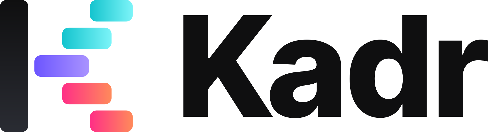
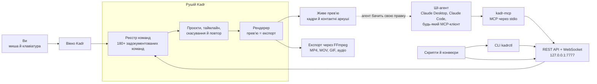

<p align="center"><a href="README.md">English</a> · <b>Українська</b></p>

<p align="center">
  <picture>
    <source media="(prefers-color-scheme: dark)" srcset="assets/logo.svg">
    
  </picture>
</p>

<h3 align="center">Відеоредактор, яким може керувати ваш ШІ-агент.</h3>

<p align="center">
  Десктопний редактор у стилі CapCut, де кожна кнопка, гаряча клавіша й пункт меню — це водночас виклик API.<br>
  Монтуйте самі або доручіть монтаж Claude та іншим ШІ-агентам через <b>MCP</b>, <b>REST</b> і <b>CLI</b> — і спостерігайте за їхньою роботою наживо.
</p>

<p align="center">
  <a href="https://github.com/gitkalenyuk/kadr/releases"></a>
  <a href="https://github.com/gitkalenyuk/kadr/releases"></a>
  <a href="https://github.com/gitkalenyuk/kadr/releases"></a>
  <a href="#встановлення"></a>
  <a href="#macos-незабаром"></a>
  <br>
  <a href="#швидкий-старт-для-ші-агентів"></a>
  <a href="#як-це-працює"></a>
  <a href="https://gitkalenyuk.github.io/kadr/uk/docs/ai/"></a>
  <a href="#приватність"></a>
  <a href="LICENSE"></a>
</p>

<p align="center">
  <a href="https://github.com/gitkalenyuk/kadr/releases"></a>
  &nbsp;
  <a href="https://gitkalenyuk.github.io/kadr/uk/docs/guide/"></a>
  &nbsp;
  <a href="https://gitkalenyuk.github.io/kadr/uk/docs/ai/"></a>
</p>

<p align="center">
  <a href="https://gitkalenyuk.github.io/kadr/uk/"><b>Сайт</b></a> ·
  <a href="#можливості">Можливості</a> ·
  <a href="#встановлення">Встановлення</a> ·
  <a href="#швидкий-старт-для-ші-агентів">Старт для ШІ</a> ·
  <a href="#документація">Документація</a> ·
  <a href="CHANGELOG.md">Зміни</a> ·
  <a href="#часті-питання">Питання</a> ·
  <a href="https://github.com/gitkalenyuk/kadr/issues/new/choose">Повідомити про помилку</a>
</p>

<p align="center">
  
</p>

> [!NOTE]
> Kadr зараз у **публічній беті**: виходять попередні релізи `0.1.0-beta.N`, доки не буде готова фінальна 0.1.0.
> Можливі шорсткості — будь ласка, [повідомляйте про них](https://github.com/gitkalenyuk/kadr/issues/new/choose).
> У цьому репозиторії лише **релізи, документація та сайт**: Kadr — безкоштовна програма із закритим кодом.

## Чому Kadr

<table>
<tr>
<td width="33%" valign="top">

**Монтаж як у CapCut**

Магнітний багатодоріжковий таймлайн, медіатека, плеєр із маркерами просто на кадрі та інспектор. Розрізайте
кліп <kbd>Ctrl</kbd>+<kbd>B</kbd>, кидайте перехід на склейку, додавайте субтитри й експортуйте для TikTok, Reels,
Shorts чи YouTube.

</td>
<td width="33%" valign="top">

**Створено для ШІ-агентів**

`kadr-mcp` перетворює кожну команду на MCP-інструмент для Claude Desktop, Claude Code та інших клієнтів. Агенти
отримують докладні описи, помилки з підказками, як їх виправити, і **очі**: `preview_frame` та
`preview_contact_sheet` повертають зображення, а `library_preview` показує, як відтворюється перехід чи ефект, ще до
того, як агент його обере.

</td>
<td width="33%" valign="top">

**Один реєстр — усі інтерфейси**

Понад 180 задокументованих команд керують інтерфейсом, гарячими клавішами, REST, OpenAPI, MCP, `kadrctl` і
документацією, тож вони ніколи не розходяться. Багато правок виконуються одним атомарним **пакетом**, який
скасовується за один крок, ще й із **пробним запуском**.

</td>
</tr>
<tr>
<td width="33%" valign="top">

**Офлайн за задумом**

Рендеринг, експорт, автосубтитри Whisper, синтез мовлення, видалення фону й пошук сцен працюють на вашому
комп’ютері. Без акаунта, телеметрії та хмари. Локальний API слухає лише `127.0.0.1` і вимагає токен.

</td>
<td width="33%" valign="top">

**Власна бібліотека**

221 перехід, 195 ефектів, 227 фільтрів, 310 анімацій кліпів, 175 текстових шаблонів, 114 стилів художнього тексту
й 394 стікери — усе створено власним рушієм Kadr; наведіть мишу на картку, і вона оживе. А ще 24 шрифти в комплекті
та 146 безкоштовних шрифтів, що встановлюються одним клацанням. Жодних ресурсів CapCut.

</td>
<td width="33%" valign="top">

**Безпечні оновлення**

Оновлення надходять із цього репозиторію й встановлюються, лише коли збігаються і **підпис Ed25519**, і **SHA-256**
інсталятора. Канали Stable і Beta, пропуск версії або повне вимкнення перевірок.

</td>
</tr>
</table>

## Подивіться в дії

| Анімації тексту по літерах і художній текст | Короткий монтаж, відрендерений рушієм |
|---|---|
|  |  |
| **Офлайн-автосубтитри з підсвічуванням слів** | **221 власний перехід, відрендерений рушієм** |
|  |  |

## Як це працює

Усі шляхи до Kadr ведуть до одного реєстру команд і одного рушія. Тож людина, скрипт і ШІ-агент можуть робити
те саме, а кожна зміна одразу з’являється у вікні.



## Можливості

Кожна можливість доступна і в інтерфейсі, **і** через API. Розгорніть розділ, щоб побачити подробиці; повний
довідник команд із параметрами, одиницями та прикладами є в [документації для ШІ-агентів](https://gitkalenyuk.github.io/kadr/uk/docs/ai/)
і вбудований у застосунок за адресою `http://127.0.0.1:7777/docs`. Інтерфейс Kadr поки що англійською, тому назви
кнопок і меню нижче подано в оригіналі.

<details>
<summary><b>Монтаж і таймлайн</b>: магнітна основна доріжка, накладання, ключові кадри, криві швидкості, маски, хромакей</summary>

| Можливість | Подробиці |
|---|---|
| Проєкти | 10 співвідношень сторін (16:9, 9:16, 1:1, 4:3, 3:4, 21:9, 2.35:1, 2:1, 1.85:1, 5,8 дюйма), будь-яка частота кадрів, тло полотна (колір, розмиття чи зображення), обкладинка, дублювання й перейменування |
| Медіа | Відео, фото, аудіо й анімовані GIF — файлами чи цілими папками, кнопкою, через системний діалог або перетягуванням; виявлення дублікатів; мініатюри, кіноплівки й хвильові форми; **проксі** для плавного монтажу 4K/HEVC; повторне зв’язування переміщених файлів |
| Згенеровані медіа | Градієнти й mesh-градієнти, полярне сяйво, лавова лампа, плазма, боке, частинки (світлячки, сніг, зорі, іскри), засвічення й пил плівки для режиму накладання Screen, папір, мармур, дерево та інші текстури, декоративні візерунки, зворотні відліки й стильні таймери, прозорі банери й рамки, сітки, шахівниці, смуги й тестові таблиці: 22 типи, 98 пресетів; рухомі фони безшовно зациклені |
| Таймлайн | Магнітна основна доріжка, відеонакладання (картинка в картинці), доріжки тексту, стікерів, ефектів, фільтрів, коригування й аудіо; прилипання; зв’язування кліпів; маркери з кольором і підписом; блокування, приховування й вимкнення звуку доріжок |
| Інструменти кліпу | Розрізання <kbd>Ctrl</kbd>+<kbd>B</kbd>, видалення ліворуч/праворуч <kbd>Q</kbd>/<kbd>W</kbd>, дублювання, заміна, стоп-кадр, реверс, віддзеркалення, поворот, кадрування з пресетами пропорцій, копіювання, вирізання й вставлення |
| Швидкість | Від 0,1× до 100× зі збереженням висоти тону (*keep pitch*); криві швидкості: 6 пресетів (montage, hero, bullet, jump cut, flash in, flash out) або власна крива з 2–20 точок |
| Композитинг | Положення, масштаб і поворот із маркерами на кадрі та напрямними прилипання, непрозорість, **14 режимів накладання**, 6 форм маски (лінійна, дзеркальна, коло, прямокутник, серце, зірка) з пом’якшенням краю, заокругленням та інверсією, **хромакей** |
| Ключові кадри | 22 властивості для анімації (трансформація, непрозорість, гучність, 15 параметрів кольору, інтенсивність фільтра) з лінійною інтерполяцією, ease-in, ease-out та ease-in-out |
| Скасування та історія | Кожна правка — один крок скасування, хоч би хто її зробив; пакет — теж один крок |
| My kit | Зберігайте стилі тексту, налаштування кольору, фільтри, ефекти, переходи й анімації як пресети для всіх проєктів |
| Прев’ю під мишею | Наведіть мишу на будь-який перехід, ефект, фільтр, анімацію, стиль тексту чи субтитрів, стікер або згенерований фон — і побачите його в русі; агенти бачать те саме як контактний аркуш через `library.preview` |

</details>

<details>
<summary><b>Колір</b>: 14 коригувань, HSL, криві, LUT, автокорекція, 227 фільтрів</summary>

| Можливість | Подробиці |
|---|---|
| Базові коригування | 14 повзунків: яскравість, контраст, насиченість, експозиція, температура, відтінок, світла, тіні, різкість, віньєтка, тон, вицвітання, зерно й блиск |
| HSL | 8 колірних діапазонів × тон, насиченість і світлість |
| Криві | Загальна, R, G і B — до 16 точок, плюс 7 пресетів |
| LUT | Будь-який LUT у форматі `.cube`, з інтенсивністю |
| Автокорекція | Аналізує кадр і виправляє експозицію, контраст, баланс білого й насиченість |
| Фільтри | 227 власних фільтрів у 25 категоріях (кінематографічні, вінтажні, естетичні, настрій, пори року, дуотон, портретні, що бережуть колір шкіри, та інші) з інтенсивністю, яку можна анімувати, плюс шари коригування |
| Очищення | Шумозаглушення відео та прибирання мерехтіння |

</details>

<details>
<summary><b>Текст, субтитри й голос</b>: шаблони, художній текст, анімації літер, субтитри Whisper, монтаж за транскриптом, синтез мовлення</summary>

| Можливість | Подробиці |
|---|---|
| Шрифти | 4 вбудовані шрифти, **24 безкоштовні шрифти в комплекті** (усі з кирилицею, працюють без інтернету), усі шрифти, встановлені в системі, і каталог із **146 безкоштовних шрифтів** (SIL OFL, 123 з кирилицею), які встановлюються одним клацанням; імпорт власних `.ttf`/`.otf`; пошук, фільтри за стилем і за кирилицею; запасні шрифти для кирилиці та CJK |
| Оформлення тексту | Обведення й додаткові контури, тінь, плашка (окремо під кожним рядком, з нахилом, рамкою, вирізаними літерами), світіння, градієнтна заливка, 3D-видавлювання, текст по дузі, регістр літер |
| Художній текст | 28 рухомих і статичних візерунків (глітер, голограма, мармур, шотландка, леопард…), фаска й тиснення, внутрішня тінь і світіння, «ехо»-копії, гранж і крейда, блискітки, патьоки, градієнтне обведення, ефект «від руки» й піксель-арт |
| Шаблони й художній текст | 175 текстових шаблонів у 22 категоріях і 114 ефектів художнього тексту в 16 категоріях |
| Анімації літер | 137 анімацій по літерах, словах і рядках (55 появ, 45 зникнень, 37 циклічних): друкарська машинка, розшифрування, перекидне табло, термінал, желе, дощ, глітч, гудіння неону та інші |
| **Автосубтитри** | Офлайн-Whisper (faster-whisper): близько 100 мов і автовизначення мови, таймінги окремих слів, моделі від `tiny` до `large-v3`, прискорення на GPU NVIDIA |
| Стилі й редактор субтитрів | 55 стилів у 12 категоріях, зокрема **підсвічування слів**, караоке, вистриб, підстрибування, поступова поява й світіння; редагування, розділення, об’єднання, зсув і зміна стилю реплік; імпорт SRT, VTT, ASS/SSA, LRC; експорт SRT, VTT, TXT, LRC |
| **Монтаж за транскриптом** | Видаліть слова з транскрипту — і відео обріжеться відповідно; прибирання слів-паразитів (англійська, українська, російська та ваш власний список) і пауз |
| Синтез мовлення | Локальні голоси (Windows SAPI, eSpeak NG — близько 130 мов) з вирівнюванням гучності; за бажанням — голоси ElevenLabs із вашим власним API-ключем |

</details>

<details>
<summary><b>Аудіо</b>: зведення, 25 голосових ефектів, гучність, біти, 47 звукових ефектів</summary>

| Можливість | Подробиці |
|---|---|
| Зведення | Гучність у дБ із ключовими кадрами, наростання й згасання, вимкнення звуку доріжки |
| Зміна голосу | 25 голосових ефектів — від бурундука, робота й мегафона до собору, lo-fi та покращення вокалу |
| Очищення | Шумозаглушення та нормалізація гучності до −14 LUFS з обмеженням справжнього піку |
| Аналіз | Вимірювач гучності EBU R128 і визначення бітів із BPM та автоматичними маркерами на кожному біті |
| Відокремлення звуку | <kbd>Ctrl</kbd>+<kbd>Shift</kbd>+<kbd>S</kbd> переносить звук кліпу в пов’язаний аудіокліп; повернути його можна будь-коли |
| Звукові ефекти | 47 синтезованих SFX у 9 категоріях із прослуховуванням при наведенні |

</details>

<details>
<summary><b>ШІ та розумні інструменти</b>: усе локально</summary>

| Інструмент | Що робить |
|---|---|
| Автосубтитри | Розпізнавання мовлення Whisper із таймінгами слів, а потім стилізовані репліки субтитрів |
| Видалення фону | Вирізає людину чи головний об’єкт без зеленого екрана (`rembg`, `onnxruntime` або `torch` на вашому комп’ютері) |
| Розділення на сцени | Знаходить зміни планів і розрізає кліп на кожній склейці |
| Видалення тиші | Вирізає тихі фрагменти з розмовних відео й подкастів і закриває прогалини |
| Автокадрування | Перетворює 16:9 на 9:16 (чи будь-яке інше співвідношення), стежачи за об’єктом за допомогою згладжених ключових кадрів |
| Перевірка можливостей | `ai.capabilities` і `captions.asr_status` показують, що встановлено і як додати решту |

</details>

<details>
<summary><b>Експорт</b>: до 4K60, H.264/HEVC, кодування на GPU, GIF і аудіо</summary>

| Можливість | Подробиці |
|---|---|
| Відео | 480p, 720p, 1080p, 2K і 4K; 24, 25, 30, 50 і 60 кадрів/с; **H.264** або **HEVC** у MP4 чи MOV; пресети якості або власний бітрейт |
| Кодування на GPU | NVIDIA NVENC, Intel Quick Sync і AMD AMF, коли вони доступні, з програмним кодуванням як запасним варіантом |
| Інші формати | Анімований **GIF**; лише аудіо — **MP3, WAV, AAC, FLAC**; експорт фрагмента |
| Процес | Оцінка розміру файлу, фонова черга з прогресом і скасуванням, *відкрити папку* |

</details>

<details>
<summary><b>Автоматизація</b>: REST, OpenAPI, пакети, події, MCP, CLI, режим без вікна</summary>

| Інтерфейс | Подробиці |
|---|---|
| REST API | `POST http://127.0.0.1:7777/api/v1/commands/<name>`, токен Bearer, JSON на вході й виході, помилки з кодом, повідомленням і **підказкою** |
| OpenAPI | `GET /api/v1/openapi.json` (OpenAPI 3.1) і HTML-довідник за адресою `/docs` |
| Пакети | `POST /api/v1/projects/{id}/batch` виконує багато команд як **один атомарний крок скасування**; `dry_run: true` лише перевіряє |
| Події | WebSocket `/api/v1/events`: зміни проєкту, позиція відтворення, імпорт, експорт, субтитри й прогрес ШІ |
| MCP | `kadr-mcp` (stdio) відкриває кожну команду як інструмент, плюс `kadr_batch`; зображення повертаються як справжній графічний вміст |
| Режим спостереження | `ui.open_project`, `ui.select` і `ui.toast` дають агентові змогу показувати вам, що він робить |
| CLI | `kadrctl commands`, `describe`, `run`, `batch`; зручні формати часу на кшталт `2.5s` і `00:01:02.5` |
| Без вікна | `kadr-server` запускає той самий рушій і API без вікна |

</details>

### Бібліотека

Усе тут **власне**: згенеровано або відрендерено рушієм Kadr.

| Бібліотека | Елементів | Категорій |
|---|---:|---:|
| Переходи (3D-куб і перегортання, ірисові форми, шторки, різкі панорами, наближення, обертання, рідина, частинки, кіноплівка, ретро…) | **221** | 19 |
| Відеоефекти, кожен зі своїми повзунками | **195** | 20 |
| Фільтри | **227** | 25 |
| Анімації кліпів: 105 появ, 105 зникнень, 53 комбо, 47 циклічних | **310** | 4 |
| Текстові шаблони | **175** | 22 |
| Текстові ефекти (художній текст) | **114** | 16 |
| Анімації тексту по літерах і словах | **137** | 3 |
| Стилі субтитрів | **55** | 12 |
| Стікери, з них 73 анімовані | **394** | 25 |
| Звукові ефекти, синтезовані | **47** | 9 |
| Голосові ефекти | **25** | 5 |
| Пресети згенерованих медіа | **98** | 11 |
| Безкоштовні шрифти для завантаження (SIL OFL) | **146** | 6 |

## Встановлення

### Windows (уже доступно)

| Файл | Для чого |
|---|---|
| **`Kadr-Setup-<версія>-x64.exe`** | Рекомендовано. Встановлення для поточного користувача без прав адміністратора, автоматичні оновлення |
| `Kadr-<версія>-windows-x64-portable.zip` | Запуск із будь-якої папки чи флешки; повідомляє про нові версії, але не встановлює їх |

1. Завантажте файл зі сторінки [**Releases**](https://github.com/gitkalenyuk/kadr/releases) і запустіть його. Kadr
   встановлюється в `%LOCALAPPDATA%\Programs\Kadr` (встановлення для всіх користувачів — за бажанням). Додаткові
   завдання: ярлик на робочому столі та додавання kadrctl і kadr-mcp до `PATH`.
2. **SmartScreen.** Інсталятор ще не має цифрового підпису, тож Windows може показати *«Windows захистив ваш ПК»*:
   натисніть **Докладніше → Усе одно запустити** (*More info → Run anyway*). Якщо хочете переконатися, порівняйте
   хеш файлу з `SHA256SUMS.txt` (див. нижче).
3. **WebView2.** Уже є у Windows 11 і на більшості ПК з Windows 10; якщо його немає, інсталятор підкаже, де
   завантажити його з сайту Microsoft.
4. **FFmpeg під час першого запуску.** Kadr використовує FFmpeg для всього декодування й кодування, але не постачає
   його разом із собою. Виберіть **Download now**, щоб завантажити офіційну GPL-збірку FFmpeg 7.1 від BtbN (близько
   100 МБ, з перевіркою SHA-256), або **I have FFmpeg**, щоб указати власну. `ffmpeg` у `PATH` знаходиться
   автоматично.

<details>
<summary>Що встановлюється, де зберігаються дані, перевірка й видалення</summary>

| Файл | Призначення |
|---|---|
| `Kadr.exe` | Редактор |
| `kadr-server.exe` | Рушій і API без вікна |
| `kadr-mcp.exe` | MCP-сервер для ШІ-агентів (stdio) |
| `kadrctl.exe` | Клієнт командного рядка |
| `licenses\` | Ліцензійна угода та повідомлення про сторонні компоненти |

| Шлях | Що там |
|---|---|
| `%APPDATA%\Kadr\` | Проєкти, налаштування, пресети (*My kit*), токен API (`api-token`), завантажені й імпортовані шрифти (`fonts\`), кеш |
| `%LOCALAPPDATA%\Kadr\tools\ffmpeg\bin\` | `ffmpeg.exe` і `ffprobe.exe`, якщо їх завантажив Kadr |
| `%USERPROFILE%\Videos\Kadr\` | Папка експорту за замовчуванням |

Перевірте завантажений файл у PowerShell і порівняйте результат із відповідним рядком `SHA256SUMS.txt`:

```powershell
Get-FileHash .\Kadr-Setup-0.1.0-beta.1-x64.exe -Algorithm SHA256
```

Видалити Kadr можна в **Параметри → Програми → Інстальовані програми → Kadr**. Програма видалення спитає, чи
видаляти ваші проєкти й завантажений FFmpeg; відповідайте **Ні**, щоб їх зберегти.

</details>

### macOS (незабаром)

Готуємо універсальну збірку для Mac на Apple Silicon та Intel (macOS 12 або новіша): DMG, з якого застосунок
достатньо перетягнути в «Програми», той самий API, MCP-сервер і CLI всередині пакета застосунку та підписані
автоматичні оновлення. Стежте за [релізами](https://github.com/gitkalenyuk/kadr/releases)
(**Watch → Custom → Releases**), щоб дізнатися першими.

### Автоматичні оновлення

Kadr перевіряє цей репозиторій у фоні щонайбільше раз на день (або коли ви натискаєте **Settings → Updates → Check
now**). Кожен реліз містить маніфест `latest.json`, підписаний Ed25519 (`latest.json.sig`); відкритий ключ вбудовано в
Kadr. Оновлення встановлюється, лише якщо **підпис дійсний, а SHA-256 інсталятора збігається**; тоді Kadr
оновлюється на місці, зберігає ваші проєкти й перезапускається. Канал **Stable** отримує фінальні релізи, **Beta** —
ще й попередні (бета-збірки за замовчуванням використовують Beta). Агенти можуть робити те саме командами
`update.check`, `update.install` та іншими. Подробиці й ручна перевірка — у [SECURITY.md](SECURITY.md).

## Швидкий старт для ШІ-агентів

**1. Запустіть Kadr** (застосунок або `kadr-server` без вікна). API слухає `http://127.0.0.1:7777`; токен
створюється під час першого запуску в `%APPDATA%\Kadr\api-token`, а `kadr-mcp` і `kadrctl` читають його
автоматично.

**2. Під’єднайте агента.**

<table>
<tr><th>Claude Code</th><th>Claude Desktop</th></tr>
<tr>
<td valign="top">

```powershell
claude mcp add --scope user kadr -- "$env:LOCALAPPDATA\Programs\Kadr\kadr-mcp.exe"
```

Потім виконайте `/mcp`, щоб переконатися, що `kadr` під’єднано.

</td>
<td valign="top">

**Settings → Developer → Edit Config**, потім додайте:

```json
{
  "mcpServers": {
    "kadr": {
      "command": "C:\\Users\\<you>\\AppData\\Local\\Programs\\Kadr\\kadr-mcp.exe"
    }
  }
}
```

</td>
</tr>
</table>

Будь-який інший MCP-клієнт: **stdio**-сервер із командою `kadr-mcp.exe` без аргументів. Назви інструментів пишуться
через підкреслення (`timeline_segment_split` для `timeline.segment.split`). Якщо не запущено ні застосунок, ні
`kadr-server`, `kadr-mcp` сам запускає рушій.

**3. Попросіть змонтувати відео.**

> *Створи проєкт 9:16 із кліпів у `C:\Users\me\Videos\Trip`, прибери паузи, додай автосубтитри в стилі з
> підсвічуванням слів, постав звук «вуш» на кожну склейку, покажи контактний аркуш, а потім експортуй у 1080p.*

```text
project_create {name, ratio: "9:16"} → media_import {paths} → timeline_segment_add …
ai_remove_silence → captions_auto {style_id: "cap_highlight_word", wait: true}
sfx_add … → preview_contact_sheet (агент дивиться на результат) → export_start {resolution: "1080p"}
```

<details>
<summary><b>REST за 60 секунд</b> (PowerShell і curl)</summary>

```powershell
$token = (Get-Content "$env:APPDATA\Kadr\api-token" -Raw).Trim()
$h     = @{ Authorization = "Bearer $token" }
$api   = "http://127.0.0.1:7777/api/v1"
(Invoke-RestMethod -Method Post "$api/commands/project.create" -Headers $h `
   -ContentType 'application/json' -Body '{"name":"My TikTok","ratio":"9:16"}').result.id
```

```bash
TOKEN=$(cat "$APPDATA/Kadr/api-token")
curl -s -X POST http://127.0.0.1:7777/api/v1/commands/project.create \
  -H "Authorization: Bearer $TOKEN" -d '{"name":"My TikTok","ratio":"9:16"}'
# → {"ok":true,"result":{"id":"prj_…", …}}

# Кілька правок як ОДИН крок скасування (додайте "dry_run": true, щоб лише перевірити):
curl -s -X POST http://127.0.0.1:7777/api/v1/projects/prj_…/batch -H "Authorization: Bearer $TOKEN" -d '{
  "calls": [
    {"command": "text.add",   "args": {"text": "Day 1", "template_id": "title_bold", "at_us": 0, "duration_us": 3000000}},
    {"command": "filter.add", "args": {"filter_id": "film", "at_us": 0, "duration_us": 5000000, "intensity": 0.6}}
  ]}'
```

Час задається **цілими числами в мікросекундах** (`1 с = 1000000`). Кожна помилка містить `hint` — підказку, як
виправити виклик.

</details>

<details>
<summary><b>kadrctl</b></summary>

```powershell
kadrctl commands timeline                 # команди однієї категорії
kadrctl describe captions.auto            # повна документація однієї команди
kadrctl run project.create --name "My TikTok" --ratio 9:16
kadrctl run timeline.segment.split --project_id prj_123 --segment_id seg_4 --at_us 2.5s
kadrctl batch prj_123 edits.json --dry-run
```

Якщо ви не додали kadrctl до `PATH`, викликайте `& "$env:LOCALAPPDATA\Programs\Kadr\kadrctl.exe"`. Змінні
`KADR_ADDR` і `KADR_TOKEN` спрямовують його на інший екземпляр.

</details>

## Документація

<table>
<tr>
<td width="50%" valign="top">

### Для людей

Як користуватися редактором: огляд інтерфейсу, монтаж на таймлайні, текст і субтитри, ефекти й колір, аудіо,
інструменти ШІ, експорт, гарячі клавіші, налаштування та розв’язання проблем.

**[Посібник користувача →](https://gitkalenyuk.github.io/kadr/uk/docs/guide/)** · [English](https://gitkalenyuk.github.io/kadr/docs/guide/)

</td>
<td width="50%" valign="top">

### Для ШІ-агентів

Як агент керує Kadr: налаштування MCP, REST і CLI, концепції (проєкти, доріжки, сегменти, час у мікросекундах),
рецепти, найкращі практики, повний довідник команд і машиночитні файли
([`llms.txt`](https://gitkalenyuk.github.io/kadr/llms.txt), англійською).

**[Документація для ШІ →](https://gitkalenyuk.github.io/kadr/uk/docs/ai/)** · [English](https://gitkalenyuk.github.io/kadr/docs/ai/)

</td>
</tr>
</table>

## Системні вимоги

| | Мінімум | Рекомендовано |
|---|---|---|
| ОС | Windows 10 1809 (64-біт) | Windows 11 (64-біт) |
| Процесор | x64 | 6 ядер або більше |
| Пам’ять | 4 ГБ | **8 ГБ** або більше (16 ГБ для 4K) |
| Графіка | Будь-який GPU, який підтримує Windows | GPU NVIDIA, Intel чи AMD з апаратним відеокодером |
| Середовище | Microsoft Edge WebView2 (уже є у Windows 11) | |
| FFmpeg | Kadr завантажує його під час першого запуску, або ваш власний | |
| Диск | Близько 1 ГБ для Kadr і FFmpeg, плюс місце для проєктів, кешу й проксі | SSD |

Додаткові компоненти, які Kadr виявляє під час роботи (і підказує, як увімкнути відсутнє):

| Додатково | Що дає |
|---|---|
| **GPU NVIDIA** (NVENC; CUDA для Whisper) | Швидкий експорт H.264/HEVC і розпізнавання мовлення з прискоренням на GPU (Quick Sync і AMF теж використовуються для експорту) |
| **Python 3.9+ із `faster-whisper`** (модель завантажується один раз) | Автосубтитри й монтаж за транскриптом |
| **`rembg` / `onnxruntime`** або ONNX-модель матування | Видалення фону |
| **eSpeak NG** | Синтез мовлення приблизно 130 мовами на додачу до голосів Windows |

`KADR_PYTHON` задає конкретний інтерпретатор Python; `captions.asr_status` і `ai.capabilities` показують, що знайшов Kadr.

## Приватність

- **Ваші медіа лишаються на вашому комп’ютері.** Kadr нікуди не завантажує, не синхронізує й не аналізує ваші
  файли; усі інструменти ШІ працюють локально.
- **Без акаунта, телеметрії, аналітики й реклами.**
- **Мережа** потрібна лише для перевірки оновлень (щонайбільше раз на день, її можна вимкнути), завантаження
  оновлення, яке ви підтвердили, необов’язкового одноразового завантаження FFmpeg, безкоштовних шрифтів, які ви
  самі вирішили завантажити (з репозиторію google/fonts на GitHub), і голосів ElevenLabs — тільки якщо ви додали
  власний ключ (тоді текст для озвучення надсилається в ElevenLabs).
- **Локальний API приватний.** Він слухає лише `127.0.0.1`, приймає запити тільки з локальних джерел і вимагає
  токен із `%APPDATA%\Kadr\api-token`; видаліть цей файл і перезапустіть Kadr, щоб відкликати доступ для всіх
  інструментів.
- **Агенти діють із вашими правами.** Під’єднаний MCP-клієнт може змінювати й видаляти проєкти Kadr та записувати
  експортовані файли. Під’єднуйте лише агентів, яким довіряєте; кожну правку можна скасувати.

## Часті питання

<details>
<summary><b>Kadr безкоштовний?</b></summary>

Так. Kadr — **безкоштовна програма**: використовуйте її на будь-якій кількості своїх комп’ютерів, зокрема для
комерційних проєктів, без водяних знаків, підписки й акаунта. Ваші відео належать вам. Код Kadr закритий; умови — у
[LICENSE](LICENSE).
</details>

<details>
<summary><b>Kadr — це CapCut? Він пов’язаний із CapCut чи ByteDance?</b></summary>

Ні. Kadr — незалежний редактор зі звичним робочим процесом у стилі CapCut. Усі переходи, ефекти, фільтри, шаблони,
стікери, звуки й стилі субтитрів — власні. *CapCut* — торговельна марка її власника.
</details>

<details>
<summary><b>Windows пише «Windows захистив ваш ПК» (<i>Windows protected your PC</i>). Це безпечно?</b></summary>

Інсталятор поки що не підписаний платним сертифікатом, тож SmartScreen його не впізнає. Натисніть
**Докладніше → Усе одно запустити** (*More info → Run anyway*) і порівняйте SHA-256 файлу з `SHA256SUMS.txt` того самого релізу. Оновлення, які
встановлює сам Kadr, завжди перевіряються (підпис Ed25519 плюс SHA-256).
</details>

<details>
<summary><b>Навіщо Kadr потрібен FFmpeg і чому його немає в комплекті?</b></summary>

FFmpeg декодує й кодує всі відео- та аудіофайли. Kadr запускає його як окрему програму й не постачає разом із собою.
Під час першого запуску він може завантажити для вас офіційну GPL-збірку від BtbN, або ви можете використати власну:
вкажіть її папку, додайте її до `PATH` чи задайте `KADR_FFMPEG_DIR`. Див. [THIRD_PARTY_NOTICES.md](THIRD_PARTY_NOTICES.md).
</details>

<details>
<summary><b>Які ШІ-агенти можуть працювати з Kadr? Чи бачать вони результат?</b></summary>

Будь-який MCP-клієнт (Claude Desktop, Claude Code та інші) через `kadr-mcp`, будь-що, що вміє робити HTTP-запити,
через REST API, і скрипти через `kadrctl`. `preview_frame` повертає саме той кадр, який буде в експорті, а
`preview_contact_sheet` показує багато моментів таймлайну на одному зображенні. А перш ніж обрати перехід, ефект
чи анімацію тексту, агент може подивитися через `library_preview`, як вони відтворюються.
</details>

<details>
<summary><b>А якщо агент щось зіпсує?</b></summary>

Натисніть <kbd>Ctrl</kbd>+<kbd>Z</kbd>. Кожна правка агента — звичайний крок скасування, а `kadr_batch` — один крок.
Агенти також можуть виконати пробний запуск пакета, перш ніж щось зміниться.
</details>

<details>
<summary><b>Автосубтитри чи видалення фону пишуть «not available».</b></summary>

Субтитри: встановіть Python 3.9+, виконайте `pip install faster-whisper`, а потім один раз завантажте модель,
наприклад `python -c "from faster_whisper import WhisperModel; WhisperModel('small')"`. Видалення фону:
`pip install rembg onnxruntime` або покладіть ONNX-модель матування в `%APPDATA%\Kadr\models\matting.onnx`. Якщо
Python немає в `PATH`, задайте `KADR_PYTHON`. Що саме знайшов Kadr, показують `captions.asr_status` і `ai.capabilities`.
</details>

<details>
<summary><b>Чи можна запускати Kadr без вікна або на іншому порту?</b></summary>

Так. `kadr-server` запускає той самий рушій і API без вікна. `KADR_ADDR` (наприклад, `127.0.0.1:7788`) змінює порт
для Kadr та інструментів, які з ним працюють; `KADR_DATA_DIR` дає змогу запускати ізольовані екземпляри поруч.
</details>

<details>
<summary><b>Які файли можна імпортувати?</b></summary>

Відео: MP4, MOV, M4V, MKV, WebM, AVI, WMV, FLV, MTS/M2TS, TS, 3GP, MPEG, OGV, MXF та анімовані GIF. Аудіо: MP3, WAV,
AAC, M4A, FLAC, OGG, Opus, WMA та AIFF. Зображення: JPEG, PNG, BMP, WebP, TIFF, HEIC/HEIF та AVIF. Кодеки всередині
мають підтримуватися вашою збіркою FFmpeg; збірка, яку завантажує Kadr, охоплює всі поширені.
</details>

<details>
<summary><b>А macOS чи Linux?</b></summary>

Універсальна збірка для macOS (Apple Silicon та Intel) — наступна; див. розділ [macOS](#macos-незабаром). Linux — у
планах. Рушій кросплатформний.
</details>

## Плани

Це плани, а не обіцянки. Голосуйте реакцією «палець угору» під
[запитами на нові функції](https://github.com/gitkalenyuk/kadr/issues?q=is%3Aissue+label%3Aenhancement).

- Збірки для **macOS** (наступна) і **Linux**
- Підписаний інсталятор; пакети **winget** і **Scoop**
- Шаблони проєктів зі слотами для власних медіа
- Власна бібліотека музичних лупів і підкладок без роялті
- Ефекти для тіла (контур, аура, клон), трекінг руху й камери
- Сповільнення з оптичним потоком, інструменти ретуші, більше мов для прибирання слів-паразитів
- API плагінів для сторонніх постачальників ресурсів

## Підтримка

- **Питання:** [посібник користувача](https://gitkalenyuk.github.io/kadr/uk/docs/guide/),
  [документація для ШІ](https://gitkalenyuk.github.io/kadr/uk/docs/ai/) і [часті питання](#часті-питання).
- **Помилки:** [створіть звіт про помилку](https://github.com/gitkalenyuk/kadr/issues/new?template=bug_report.yml) і
  вкажіть версію Kadr (**Settings → About**).
- **Ідеї:** [запропонуйте функцію](https://github.com/gitkalenyuk/kadr/issues/new?template=feature_request.yml).
- **Проблеми безпеки:** повідомляйте приватно, див. [SECURITY.md](SECURITY.md). Більше — у [SUPPORT.md](SUPPORT.md).

## Ліцензія

Kadr — **безкоштовна програма із закритим кодом**, що поширюється за [ліцензійною угодою з кінцевим
користувачем](LICENSE). Вона побудована на компонентах із відкритим кодом (Go, Wails, React та інші), перелічених у
[THIRD_PARTY_NOTICES.md](THIRD_PARTY_NOTICES.md) і в папці `licenses\` кожної інсталяції. **FFmpeg** не
поширюється разом із Kadr: його завантажують на запит з офіційних збірок BtbN за ліцензією GNU GPL, і він працює як
окрема програма.

---

<p align="center">
  <a href="https://gitkalenyuk.github.io/kadr/uk/">gitkalenyuk.github.io/kadr</a> ·
  <a href="README.md">English</a><br>
  <sub>CapCut — торговельна марка відповідного власника. Kadr не пов’язаний із CapCut чи ByteDance і не схвалений ними.</sub>
</p>
